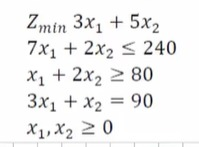

# Gray Wolf Algorithm

The Gray Wolf Algorithm (GWA) is a population-based metaheuristic optimization algorithm that was inspired by the hunting behavior of gray wolves in the wild. The algorithm was proposed by Seyedali Mirjalili, Seyed Mohammad Mirjalili, and Andrew Lewis in 2014, and has since been applied to a wide range of optimization problems in various fields.

This repository contains a Python implementation of the Gray Wolf Algorithm, along with examples of how to use it to solve various optimization problems.

### Installation

To use the Gray Wolf Algorithm, you first need to install Python 3.x on your system. You can download the latest version of Python from the official Python website: https://www.python.org/downloads/

Once you have Python installed, you can install the Gray Wolf Algorithm package using pip:

### Usage
algorithm was created for the following example.

<figure>

</figure>
